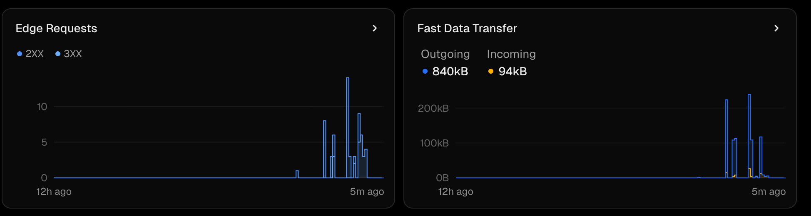

# Todo App - Frontend

A modern, responsive Todo application built with React and Tailwind CSS. Features JWT authentication, real-time updates, and a clean user interface.


**Live Demo**: https://todo-app-frontend-silk-one.vercel.app  
**Backend API**: https://todo-app-production-218b.up.railway.app

## Features

### Authentication
- JWT-based authentication with automatic token management
- Auto-logout on token expiry (session timeout)
- Protected routes with authentication
- Persistent sessions using localStorage
- Smooth login/register experience with form validation

### Todo Management
- Create, read, update, and delete todos
- Toggle completion status with instant feedback
- Add optional descriptions to todos
- Smart sorting (incomplete tasks first, newest first)
- User data isolation (only see your own todos)
- Live statistics (total, completed, remaining)

### User Experience
- Toast notifications for all actions (success/error feedback)
- Fast, responsive interface
- Modern UI with Tailwind CSS
- Mobile-responsive design
- Gradient backgrounds and smooth transitions
- Accessible form inputs and buttons

## Tech Stack

- **React 19** - Modern React with hooks and functional components
- **Vite 7** - Next-generation frontend build tool (fast HMR)
- **Tailwind CSS v3** - Utility-first CSS framework
- **React Router v7** - Declarative routing for React
- **Axios** - HTTP client with request/response interceptors
- **React Hot Toast** - Beautiful toast notifications
- **React Context API** - Global state management for authentication
- **Vitest** - Unit testing with @testing-library/react

## Prerequisites

- Node.js 18+ and npm
- Backend API running (see backend README)

## Getting Started

### Installation

```bash
# Clone the repository
git clone <your-repo-url>
cd todo-app-frontend

# Install dependencies
npm install

# Create environment file
cp .env.example .env
```

### Environment Variables

Create a `.env` file in the root directory:

```env
# Backend API URL
VITE_API_URL=http://localhost:8080/api

# For production
# VITE_API_URL=https://your-backend.railway.app/api
```

### Development

```bash
# Start development server (http://localhost:5173)
npm run dev

# Build for production
npm run build

# Preview production build
npm run preview

# Lint code
npm run lint

# Run tests (watch mode)
npm run test

# Run tests once
npm run test:run
```

## Project Structure

```
src/
├── components/              # Reusable UI components
│   ├── TodoItem.jsx        # Individual todo item with edit/delete
│   ├── TodoForm.jsx        # Form to add new todos
│   ├── ConfirmDialog.jsx   # Confirmation modal for destructive actions
│   └── TodoSkeleton.jsx    # Loading skeleton for todo list
├── context/                # React Context for global state
│   ├── AuthContext.js      # Bare context object (createContext)
│   ├── AuthProvider.jsx    # Provider with login/register/logout logic
│   └── useAuth.js          # useAuth hook
├── pages/                  # Route-level page components
│   ├── AuthPage.jsx        # Login/Register page
│   └── TodoPage.jsx        # Main todo list page
├── services/               # External service integrations
│   └── api.js              # Axios instance with interceptors
├── utils/                  # Pure utility functions
│   ├── jwt.js              # isTokenExpired helper
│   └── toast.js            # showSuccess/showError wrappers
├── constants/              # App-wide constants
│   ├── messages.js         # Toast and auth error messages
│   └── storage.js          # localStorage key constants
├── test/                   # Test setup
│   └── setup.js            # @testing-library/jest-dom setup
├── App.jsx                 # Root component with providers
└── main.jsx                # Application entry point
```

## Key Implementation Details

### Authentication Flow

1. User logs in/registers via `AuthPage`
2. `AuthContext` receives JWT token from backend
3. Token stored in localStorage for persistence
4. Axios request interceptor adds token to all API calls
5. Axios response interceptor handles 401 (auto-logout)
6. `ProtectedRoute` guards `/todos` route

### API Integration

**Axios Interceptors:**

```javascript
// Request interceptor - add JWT to all requests
api.interceptors.request.use((config) => {
  const token = localStorage.getItem('token');
  if (token) {
    config.headers.Authorization = `Bearer ${token}`;
  }
  return config;
});

// Response interceptor - handle auth errors
api.interceptors.response.use(
  (response) => response,
  (error) => {
    if (error.response?.status === 401 || error.response?.status === 403) {
      // Auto-logout and redirect to login
    }
    return Promise.reject(error);
  }
);
```

### State Management

**Authentication state managed via React Context, split across three files to satisfy react-refresh rules:**

- `AuthContext.js` — bare `createContext()` export
- `AuthProvider.jsx` — provider component with login/register/logout logic and localStorage persistence
- `useAuth.js` — `useAuth` hook for consuming context in components

**Todo state managed locally in TodoPage (no global state needed):**

```javascript
const [todos, setTodos] = useState([]);
const [loading, setLoading] = useState(true);
const [error, setError] = useState('');
```

### Todo Sorting Strategy

Todos are sorted client-side for instant feedback:

1. **Primary sort:** Incomplete tasks first
2. **Secondary sort:** Newest first (by ID)

**Why client-side?**
- Instant re-ordering when completing todos
- No network latency
- Fast for current scale (<100 todos per user)
- Can add user-configurable sorting later

**Migration path:** Move to backend sorting if users exceed 500+ todos or when adding pagination.

## API Endpoints Used

| Method | Endpoint | Description |
|--------|----------|-------------|
| POST | `/auth/register` | Register new user |
| POST | `/auth/login` | Login user |
| GET | `/todos` | Get all user's todos |
| POST | `/todos` | Create new todo |
| PUT | `/todos/:id` | Update todo |
| DELETE | `/todos/:id` | Delete todo |


## Testing

```bash
# Run tests in watch mode
npm run test

# Run tests once (CI)
npm run test:run
```

Tests cover utils (`jwt.js`, `toast.js`) and components (`TodoItem`, `TodoForm`, `ConfirmDialog`) using Vitest and @testing-library/react.

## Performance Optimizations
- Vite for fast development and optimized builds
- Code splitting via React Router lazy loading (ready for future implementation)
- Efficient re-renders with React state updates
- Tailwind CSS purges unused styles in production
- Static asset caching via Vercel CDN

## Observability
Using built-in dashboards from Vercel.


## Future Enhancements
- Due dates and reminders
- Todo categories/tags
- Search and filter functionality
- Dark mode toggle
- Drag-and-drop reordering
- Bulk actions (complete all, delete completed)
- User profile management
- Export todos to CSV/JSON
- Offline support with service workers
- Real-time updates with WebSockets

## License
This project is open source and available under the [MIT License](LICENSE).

## Author
Built as a portfolio project to demonstrate:
- Modern React development patterns
- JWT authentication implementation
- RESTful API integration
- Responsive UI/UX design
- Production deployment best practices